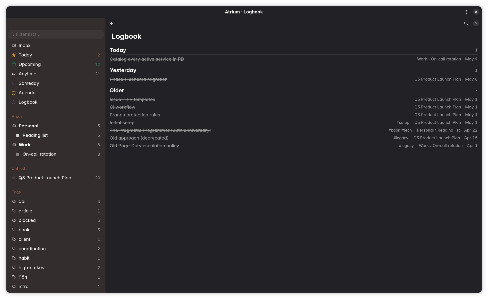

<p align="center">
  
</p>

<p align="center">
  <a href="https://www.rust-lang.org/"></a>
  <a href="LICENSE"></a>
  
  
  
  
</p>

---

# Atrium

**The native GNOME task manager you grow into, not out of.**

Atrium is the first GNOME-native productivity app that synthesises four traditions into one store: **Org-mode's data discipline** (UUIDs everywhere, plain-text round-trip, three repeater semantics, contexts as multi-attach tags, a full bidirectional `.org` vault), **Things 3's calm** (six canonical lists, the `When`/`Deadline` distinction, deliberate omission), **OmniFocus's depth** (defer dates, sequential projects, forecast, review queues, perspectives), and **Calibre's search vocabulary** (boolean expression grammar, regex match modifiers, `is:` predicates, sort modifiers). It's not a clone of any one of them. It's what happens when you stop forcing users to pick.

Two surfaces over one store. **Simple Mode** for *what am I doing right now* — Things calm, six lists, no defer dates, no review queue. **Builder Mode** for the days the system needs to do the work — Forecast, Calendar, Review, Perspectives, repeating tasks, sequential projects, the always-visible Inspector pane, full Org-mode bidirectional mirror. Same schema, same rows; mode is a UI-layer flip that never touches the database. The OmniFocus superset is the schema on day one — Simple Mode hides Builder columns, it doesn't lack them.

**Current release: v0.20.0.** Simple Mode, Builder Mode, Calibre-powered search, the kanban renderer, two-way Org-mode sync, Calendar Month View, Todoist CSV import, and the inline-syntax engine (with tab-completion popover) shipped through v0.13.0. **Phase 18.5** added the Org-mode power features for Builder Mode across v0.14.0 → v0.19.0 — per-task DEADLINE warning windows, statistics cookies + body inline checkboxes, custom TODO sequences (`#+TODO: TODO NEXT WAITING | DONE`), CLOCK time tracking with `:LOGBOOK:` round-trip, Quick Entry templates (`org-capture`-style), ID-based links between tasks (`[[id:UUID][label]]`), and scheduled time-of-day. **Phase 19.5** opened at v0.20.0 with the first app-level preferences dialog (`AdwPreferencesDialog`, `Ctrl+Comma`) and system-notification reminders (per-task `reminder_at` → `gio::Notification`). Full release narrative in [`patchnotes.md`](patchnotes.md); plan in [`roadmap.md`](roadmap.md).

**Author's Note:** I'm a college student in my late thirties with no professional industry experience yet — Atrium is one in a string of native Linux desktop apps I'm building to learn the craft and assemble a portfolio. I came from Things 3 and OmniFocus on macOS / iOS, and Linux has nothing in their lane that isn't an Electron wrapper or a CalDAV form over a webview. Atrium is the answer I wanted to exist. I work on Fedora 44 on a ThinkPad T14s AMD Gen 6; that's the environment it'll be tested against. I welcome contributions but can only honestly support my own setup.

## Why this exists

Four forces converge here.

**Org-mode without Emacs.** Org gives you UUIDs on every node, deadlines and schedules as distinct fields, repeating tasks with three completion semantics (`+` / `++` / `.+`), tags as multi-attach metadata, and full plain-text round-trip. None of those primitives are deep — they're a few hundred lines of contract. The reason most people don't use Org isn't that the model is wrong; it's that the surface is Emacs. Atrium gives you the same primitives in a GTK4 native app, mapped 1:1. Two-way `inotify`-driven sync means edits in Doom or vim-orgmode flow back inside ~200 ms. Atrium isn't an Org client; the vault is a peer projection.

**Things 3 and OmniFocus, on Linux, done right.** The two apps that taught GTD to a generation fail in opposite ways. Things 3 is calm and beautiful, and so deliberate about what it omits that power users eventually outgrow it — no defer dates, no review queue, no forecast, no sequential projects. You leave because the tool can't keep up with your system. OmniFocus is the opposite — every GTD knob exposed, every facet editable. Its failure mode is *fiddling with fields instead of doing tasks*. Atrium's pitch: a user grows into Builder Mode when their system demands it, and falls back to Simple Mode when the system doesn't, **without abandoning their data or their app**.

**Calibre-style search vocabulary, everywhere search runs.** Boolean expression grammar (`AND` / `OR` / `NOT`, parens, `NOT > AND > OR` precedence). Match modifiers on every text field (`tag:work` substring, `tag:=work` exact, `tag:~regex`, `tag:?fuzzy`). Comparison + range on dates and numerics. State predicates as `is:NAME` shortcuts. Sort modifiers. The same grammar parses in the search bar, drives saved Perspectives, runs through `atrium-cli`, and translates to SQL fast-paths when expressible. Power users get power; casual users see a search box.

**Local-first, no exceptions.** SQLite at `$XDG_DATA_HOME/atrium/atrium.db`. WAL mode, single-writer worker, read-only connection pool. No CalDAV client, no cloud sync, no telemetry, no accounts. The Org vault is filesystem mirroring, not network — your data lives on your machine and stays there unless you choose to move it. VTODO export (Phase 19) is a one-way file dump for handoff; Atrium will never become a CalDAV client.

## Screenshots

<p align="center">
  
</p>

*Today, Simple Mode — six canonical lists, coloured `#tag` pills, the Area › Project context chip on each row, the per-area row-left accent stripe.*

<p align="center">
  
</p>

*Today, Builder Mode — same data, same row, with the always-visible Inspector pane exposing the Builder fields Simple Mode hides (defer dates, repeat rules, review intervals).*

<p align="center">
  
</p>

*Upcoming, Simple Mode — the next 7 days as a When-axis read.*

<p align="center">
  
</p>

*Upcoming, Builder Mode — defer-aware filtering, sequential-project dimming, Inspector pane open.*

<p align="center">
  
</p>

*Project page — area accent paints the row-left stripe; the breadcrumb in the header anchors `Area › Project`.*

<p align="center">
  
</p>

*Logbook — completed tasks grouped by day-band.*

## Simple Mode (shipping)

A direct Things 3 analogue for GNOME:

| | |
|---|---|
| **Lists** | Inbox · Today · Upcoming · Anytime · Someday · Logbook (with day-band grouping) |
| **Hierarchy** | Areas → Projects → Tasks |
| **Tags** | Multi-tag, orthogonal to areas/projects, with their own pages — inline `#tag` edit syntax. Six-swatch picker in the editor, coloured dot in the sidebar, coloured `#pill` on every task row. |
| **Areas** | Same six-swatch palette tags use. Coloured area paints a 3 px row-left stripe on every task row whose project lives under it — cross-list views (Today, Forecast) show at a glance which area a task came from. |
| **Dates** | Distinct *When* (scheduled-for) and *Deadline* — the Things 3 detail most clones get wrong. Plus `defer_until` available in Builder Mode. |
| **Quick Entry** | `Ctrl+Alt+Space` → small modal → drops to Inbox without stealing focus; supports `#tag` / `@today` / `@tomorrow` / `@someday` / `@yyyy-mm-dd` / `@<weekday>` / `@deadline 2026-04-15` / `!1`-`!3` priority inline syntax with tab-completion. **Templates** (v0.18.0): pre-fill the entry from a saved shape (target project, prefix text, default tags); pick from a header bar above the entry, or trigger inline via `:LETTER ` (`org-capture`-style — typing `:c ` activates the template bound to `c`). |
| **Search** | `Ctrl+F` opens an FTS5-backed bar with the **Calibre-powered expression grammar**. Boolean (`AND` / `OR` / `NOT`, parens), comparison + range on date and numeric fields (`due:>today`, `due:2026-05-01..2026-05-31`), date keywords (`today`, `thisweek`, `5daysago`, `Ndaysout`), state predicates (`is:open`, `is:overdue`, `is:repeating`, `is:today`, `is:inbox`, `is:upcoming`, `is:anytime`, `is:someday`), match modifiers (`tag:work` substring, `tag:=work` exact, `tag:~mystery` regex, `tag:?wrok` fuzzy, `tag:true` existence), `sort:KEY` / `sort:-KEY` modifier with primary→secondary composition, `↑` / `↓` history, `?` operator-reference popover. Full operator reference in [`spec.md`](spec.md) §4.3. |
| **Area › Project context chip** | Each task row shows its parent project (and area, when set) on cross-list views. |
| **Find-as-you-type sidebar** | `Ctrl+L` filters area / project / tag rows live. |
| **Multi-select** | `Ctrl+Click` toggle, `Shift+Click` range, `Ctrl+A` select all; bulk Complete + Delete with summary toast. |
| **Undo** | `Ctrl+Z` invokes the active toast (toggle-complete + delete recover with their tag attachments intact). |
| **Drag-reorder** | Drag a row to reorder within the list; drag onto a project / Inbox sidebar row to file or unfile. |
| **Keyboard-first** | Every common op bindable; mouse optional — full chord scheme in [`docs/keymap.md`](docs/keymap.md). |
| **Accessibility** | Bundled Atkinson Hyperlegible toggle; AT-SPI labels on every interactive widget; libadwaita variables (no hard-coded colors) — see [`docs/accessibility.md`](docs/accessibility.md). |
| **Storage** | One SQLite file at `$XDG_DATA_HOME/atrium/atrium.db`; single-writer worker thread; WAL mode; UI never blocks on I/O. |
| **Local-first** | No network, no telemetry, no accounts, no CalDAV. Optional Org-mode vault projection ships today. |
| **Reminders** | Per-task `reminder_at` timestamp fires a `gio::Notification` when the wall clock passes it AND the task is open. Master toggle in Preferences gates the dispatcher; the notification opens the task's inspector on click. (v0.20.0) |
| **Preferences** | `Ctrl+Comma` opens `AdwPreferencesDialog` — General (default mode, theme override, high-legibility font, vault path), Capture (Quick Entry shortcut), Notifications (master switch). All keys write straight through to GSettings. (v0.20.0) |
| **Debug harness** | `atrium --debug` opens *Debug → Memory Watch* for live VmRSS / VmHWM / VmData against the §8 perf budget; fixture generators (1K / 10K / 50K / 100K) for stress-testing. |

## Builder Mode (shipping)

Same schema. Same data. Adds:

| | |
|---|---|
| **Defer dates** | Tasks invisible in Today/Anytime until their `defer_until` passes. |
| **Sequential projects** | Only the next incomplete task is "available" — the rest dim. |
| **Forecast** | Calendar-axis layout of the next 30 days; drag to reschedule between days. |
| **Calendar Month View** | Paper-calendar grid (7×N) sibling to Forecast and Agenda. Day cells show count badge + up to 3 inline task titles + "+N more" overflow popover; today highlighted; out-of-month days muted. Prev / Today / Next / month picker nav; `Ctrl+Shift+M` opens; Page Up / Page Down step months. Drag-to-reschedule; single-click peek; double-click drill into `scheduled:YYYY-MM-DD`. Below 600 px the grid collapses to a vertical week strip. |
| **Review** | Two-section canonical page — *Projects to review* (the stale-project queue) and *This week* (the open-task weekly walk). Per-row *Mark Reviewed* on both halves; the weekly walk gates on `task.last_reviewed_at` with a 7-day exclusion. |
| **Perspectives** | Saved filter expressions as first-class sidebar entries; *Save Search as Perspective…* in the primary menu. Perspectives with `renderer = "board"` render as a kanban with drag-drop column moves. The full editor dialog (name + filter + renderer + columns) lives via the `+` affordance trailing the *Perspectives* sidebar header. |
| **Inspector pane** | Always-visible right-side `AdwOverlaySplitView` exposing every Builder field; autosaves on focus-out / Enter. v0.14.0 → v0.20.0 added: per-task DEADLINE warning window (`-Nd` SpinRow), scheduled time-of-day (HH:MM row), reminder timestamp, ID-link picker for body text, workflow-keyword combo (when a custom TODO sequence is configured), and the CLOCK time-tracking Time group (Start / Stop, Total HH:MM, per-session log). |
| **Repeating tasks** | RFC 5545 RRULE-driven via the `rrule` crate; respects all three Org repeater modes — `+1w` (Basic), `++1w` (Cumulative — the default), `.+1w` (Next-from-completion). Spawns the next instance on completion with shifted dates and carried tags. |
| **CLOCK time tracking** | Actual-time tracking distinct from `estimated_minutes` (intent). Start/Stop on the Inspector pane; auto-closes any other running entry (mirrors Emacs's global clock). Round-trips to Org's `:LOGBOOK:` drawer — Emacs users see the same data. CLI: `atrium-cli clock in/out/log/status`. (v0.17.0) |
| **Statistics cookies + body checkboxes** | Org's `[done/total]` and `[N%]` cookies recognised on headlines and computed fresh from DB state on every vault flush — stale cookies self-heal. Body checkboxes (`- [ ]`, `- [X]`, `- [-]`) parse alongside child-task counts and fold into the same cookie. (v0.15.0) |
| **Custom TODO sequences** | Per-vault `#+TODO: TODO NEXT WAITING \| DONE CANCELLED` declarations round-trip end-to-end. Workflow keywords stash on `task.orig_keyword`; the Inspector exposes a keyword combo when a sequence is configured. CLI: `atrium-cli vault sequences set --workflow ... --done ...`. (v0.16.0) |
| **DEADLINE warning windows** | Per-task `-Nd` override on the global 7-day Today heads-up. Org's `<2026-04-15 Wed -7d>` syntax round-trips. (v0.14.0) |
| **ID links between tasks** | `[[id:UUID][label]]` in note bodies render as clickable spans; click navigates to the linked task. Inspector picker for inserting links via search-as-you-type. (v0.19.0) |
| **Project › Area breadcrumb** | Header bar shows `Area › Project` when viewing a project under an area. |

Mode flips are pure UI re-renders. The schema is the superset; Builder Mode just exposes the columns Simple Mode keeps hidden. Verified by an integration test that snapshots schema + rows before and after a switch (`tests/mode_flip_snapshot.rs`).

## Headless CLI (`atrium-cli`)

`atrium-cli` is a workspace sibling that exposes the search engine, full task + perspective CRUD, and Org / Todoist / JSON import + export from the shell. Architectural commitment: every non-GUI surface stays CLI-testable. The post-1.0 TUI (`atrium-tui`) will be the same shape — another headless consumer of `atrium-core` + `atrium-search` + `atrium-org`.

| Subcommand | Effect |
|---|---|
| `atrium-cli search EXPR` | Run a search expression (full grammar, sort modifiers honoured) and print matches. |
| `atrium-cli list NAME` | Print a canonical list. NAME ∈ task lists (`inbox`, `today`, `upcoming`, `anytime`, `someday`, `logbook`, `all`) or metadata lists (`areas`, `projects`, `tags`, `perspectives`). |
| `atrium-cli info ID` | Full details of a single task. |
| `atrium-cli add TITLE [FLAGS]` | Create a task. Flags: `--note`, `--project NAME`, `--tag NAME` (repeatable), `--scheduled DATE`, `--due DATE`, `--defer DATE`, `--estimated MIN`, `--deadline-warn N` (alias `--warn`; per-task DEADLINE warning window, v0.14.0), `--time HH:MM` (scheduled time-of-day; pairs with `--scheduled`, v0.19.0), `--reminder "YYYY-MM-DD HH:MM"` (system-notification reminder, v0.20.0). |
| `atrium-cli capture LINE` | Quick-Entry-style one-shot. Parses `#tag` / `@today` / `@<weekday>` / `@deadline yyyy-mm-dd` / `!1`-`!3` syntax via the same parser the GUI uses. |
| `atrium-cli edit ID [FLAGS]` | Diff-based modify. Same flag vocabulary as `add`; pass `none` to clear a field. `--tag X` / `--remove-tag X` / `--clear-tags` for tag editing. |
| `atrium-cli complete ID` | Toggle completion. Aliases: `done`, `toggle`. |
| `atrium-cli delete ID` | Delete a task. Prints the row before deletion so the action is auditable in pipelines. Alias: `rm`. |
| `atrium-cli clock <in\|out\|log\|status>` | CLOCK time tracking. `in <id> [--note TEXT]` opens an entry (auto-closing any other); `out <id>` closes the open entry; `log <id>` prints all entries for a task with totals; `status` shows the currently-running entry across the DB. (v0.17.0) |
| `atrium-cli template <list\|add\|edit\|remove>` | Quick Entry templates — pre-filled capture recipes surfaced in the modal as a picker bar and via inline `:LETTER ` activation. `add NAME --shortcut LETTER --project NAME --prefix TEXT --tag TAG`. (v0.18.0) |
| `atrium-cli vault sequences <list\|set\|clear> --vault PATH` | Custom TODO sequences (workflow keywords). `set --workflow TODO,NEXT,WAITING --done DONE,CANCELLED` writes the sequence to the vault sidecar; the writer projects it as `#+TODO:`. (v0.16.0) |
| `atrium-cli kanban NAME` | Render the saved Perspective NAME as kanban columns. |
| `atrium-cli perspective <create\|edit\|delete>` | Perspective write side from the shell. |
| `atrium-cli import org PATH [--dry-run]` | Org importer — single `.org` file or vault directory; `<vault>/<area>/<project>.org` maps subdirectories onto Atrium areas. |
| `atrium-cli import todoist PATH --into PROJECT_NAME [--dry-run]` | Todoist CSV importer. Sections become headings, INDENT chains map to `parent_id`, `@labels` become tags, PRIORITY 1-3 emits `priority-N`, `DATE` natural-language → RRULE + `scheduled_for`. Lossy fields (timezone, duration, deadline) surface in the per-row report. |
| `atrium-cli export org PATH` | Vault writer — emits `<vault>/<Area>/<Project>.org` per spec §7.3, atomic per file, post-write integrity check. |
| `atrium-cli export json PATH` | Lossless versioned snapshot — areas / projects / headings / tasks / tags / task_tags / perspectives in one JSON file. |

Output formats (mutually exclusive global flags):

- `--tsv` (default) — `id\tstatus\ttitle\tscheduled\tdeadline\tproject\tarea\ttags`. Header row first; `cut`/`grep`-friendly.
- `--json` — serde_json array (or single object for `info`); `jq`-friendly.
- `--human` — pretty columns with truncation; for terminal viewing.

Database resolution: `--db PATH` → `ATRIUM_DB_PATH` env → XDG default. Reads open `SQLITE_OPEN_READ_ONLY` so a buggy query attempting an INSERT errors at the engine — no CLI invocation can corrupt the user's database through a read path.

```bash
atrium-cli list today
atrium-cli search 'tag:work AND is:overdue sort:-due'
atrium-cli --json search 'is:repeating' | jq '.[] | .title'
atrium-cli info 42 --human
atrium-cli capture 'Buy milk #errand @today'
atrium-cli edit 42 --tag urgent --due tomorrow
atrium-cli complete 42
```

## Imports and exports (toward 1.0)

Direct importers ship for the apps Linux users *actually* migrate from. Things 3 (v0.6.19), TaskPaper, and OmniFocus (both v0.20.0) were dropped from the import roadmap — all three are macOS-only source apps; the realistic Linux + Org user audience effectively can't supply input files. Atrium's *schema* remains the OmniFocus superset by spec commitment regardless. Org and Todoist are first-class.

- **Org-mode** (two-way `.org` interop, with UUID round-trip via `:ID:`) — **shipping**. One-shot import + DB → vault writer + lossless JSON snapshot + `inotify`-driven vault → DB sync, all auto-debounced. Atrium's primary covenant; the agenda-parity test pins Atrium's Agenda canonical page against stock `org-agenda` over the same vault.
- **Todoist** (CSV via the official export tool) — **shipping**. `atrium-cli import todoist PATH --into PROJECT_NAME [--dry-run]`. Sections → headings, INDENT chains → subtasks, `@labels` → tags, PRIORITY 1-3 → `priority-N` tag, deterministic v5 UUIDs for re-import stability.
- **VTODO / RFC 5545** (`.ics`) — covers Endeavour, Errands, Nextcloud Tasks, Planify — Phase 19.
- **Taskwarrior** (`task export` JSON) — Phase 19.
- **todo.txt** (plain text) — Phase 19.

VTODO export is one-way — Atrium does not become a CalDAV client. The plan is to reach the Linux task ecosystem through two interop covenants — Org-mode (primary) and VTODO (cross-app baseline) — rather than per-app importer sprawl.

### See the Org-mode conversion in action

`demos/showcase/` is a hand-crafted set of three projects across two areas, deliberately rich — every TODO-cycle keyword (TODO / DONE / CANCELLED + WAITING / IN-PROGRESS / BLOCKED), every cookie combination (SCHEDULED / DEADLINE / CLOSED), all three repeater modes (`+1w` / `++1w` / `.+1w`), a multi-day RRULE, a 4-level subtask chain, body content with a SQL source block + an Org table + bullet lists + external + internal links, and Unicode (Japanese / Cyrillic / emoji / RTL).

```bash
mkdir -p ~/Tasks
gsettings set io.github.virinvictus.atrium vault-path ~/Tasks
cargo run -p atrium-cli -- import org demos/showcase/
cargo run -p atrium
```

Open any of the regenerated `.org` files in DoomEmacs to see the canonical Atrium emit format. Edit a task title in either Atrium or Emacs, save, and the other side picks the change up in ~200 ms via the `inotify` watcher.

The full reference for what's preserved + what isn't lives at [`docs/org-roundtrip.md`](docs/org-roundtrip.md) — supported constructs, known limits, the round-trip contract from spec §7.3.3, and pointers into the parser / emitter / writer / watcher / sidecar code.

## Status

Atrium is at **v0.20.0** on the road to v1.0. Phases land in [`roadmap.md`](roadmap.md), broken into 20 numbered phases plus four sub-phases (12.5, 15.5, 15.75, 19.5):

| Phase | Scope | Status |
|---|---|---|
| 0–9 | Simple Mode | shipped (v0.1.0) |
| 10–15 | Builder Mode | shipped (v0.2.0) |
| 15.5 | Calibre-powered search | shipped (v0.4.0) |
| 15.75 | Polish + atrium-search/atrium-cli extraction + kanban + Agenda | shipped (v0.5.0–v0.6.5) |
| 16 | Org-mode import + DB → vault writer | shipped (v0.8.0; atrium-org crate split at v0.9.0) |
| 17 | Vault → DB two-way sync (`inotify`-driven) | shipped (v0.10.3) |
| 12.5 | Calendar Month View | shipped (v0.11.0) |
| 18 | Todoist CSV import | shipped (v0.12.0) |
| atrium-inline arc | Inline-syntax in rename + tab-completion popover + crate extraction | shipped (v0.13.0) |
| 18.5 | Org-mode power features (DEADLINE warnings, statistics cookies, custom TODO sequences, CLOCK, capture templates, ID links, scheduled time-of-day) | shipped (v0.14.0–v0.19.0) |
| 19 | VTODO / Taskwarrior / todo.txt imports + VTODO export | planned |
| 19.5 | Productivity essentials — preferences dialog + system-notification reminders | partial (v0.20.0); subtasks UI / EDS overlay / dependencies / drag-drop / templates / onboarding / backup planned |
| 20 | l10n, accessibility round 2, capture daemon (`atriumd`), Flathub | planned (→ v1.0) |
| Beyond 1.0 | `atrium-tui` (full headless TUI) | planned (→ v2.0) |

[`patchnotes.md`](patchnotes.md) tracks every release entry, newest at top.

## Architecture (in one paragraph)

Six workspace crates: **`atrium-core`** is the headless data layer (domain types, single-writer SQLite worker, paths, errors, repeat-rule wrapper, atomic-write helper + lossless JSON snapshot, `VaultDirtyNotifier` trait + `VaultConfig` for the projection hook). **`atrium-search`** is the Calibre-style search expression language (lex / parse / ast / eval; depends on `atrium-core` for `Task` and `ScheduledFor`). **`atrium-org`** is the Org-mode projection (parser, emitter, importer, `VaultWriter` + `VaultWatcher` tasks; provides `OrgVaultNotifier` impl). **`atrium-inline`** is the inline-syntax parser shared by every capture surface (`#tag` / `@today` / `@<weekday>` / `@deadline` / `!N` plus the tab-completion model). **`atrium-cli`** is the headless CLI (depends on core, search, org, inline). **`atrium`** is the GTK4 binary (depends on all five). The data layer uses SQLite in WAL mode with the schema modeled as the OmniFocus superset; a dedicated `tokio` worker task owns the writable connection while the UI reads through a separate read-only connection pool. Updates arrive as `TaskChanges` and `LibraryChanges` deltas via a `glib::MainContext` channel, never as full reloads. Mode (Simple / Builder) is a per-app GSettings flag — flipping it never touches the DB. An optional Org vault (configured via the `vault-path` GSettings key) projects task state to `.org` files for editing in Emacs / Doom / any Org tool: the `VaultWriter` task receives `ProjectDirty` notifications from every Task / Project / Tag write, debounces ~100 ms, and rewrites the affected project's `.org` file via the atomic-write helper with a post-write integrity check. The `VaultWatcher` task uses `notify` / inotify to flow external edits back into the DB by `:ID:` diff. SQLite stays canonical; the vault is downstream. v0.20.0 added a single-task reminder service on the GLib MainContext that polls `next_pending_reminder` and fires `gio::Notification` per task at the scheduled moment, gated by the `notifications-enabled` GSettings key (sibling to `vault-path` and `theme`). A `--debug` CLI flag opens an in-app debug surface for stress fixtures and live memory watch. See [`spec.md`](spec.md) §3 for the full architecture and §4 for the schema.

## Stack

- **Rust 2024 Edition**
- **GTK 4.16+** / **libadwaita 1.7+**
- **SQLite** via `rusqlite` (`bundled`, `chrono`, `trace` features) — single-writer worker, WAL mode, FTS5 for search
- **`tokio`** runtime; **`chrono`** for dates; **`serde`** / **`serde_json`** for export formats; **`anyhow`** / **`thiserror`** for errors; **`tracing`** for diagnostics
- **`rrule`** for RFC 5545 RRULE iteration; **`regex`** (in `atrium-search` only) for the `tag:~regex` modifier; **`uuid`** for `:ID:` round-trip; **`notify`** (in `atrium-org` only) for the vault watcher
- **Meson** wrapper over Cargo so Flatpak packaging is straightforward
- **Bundled fonts** (SIL OFL): Inter Variable, Source Serif 4, JetBrains Mono, Atkinson Hyperlegible — installed via fontconfig at first run; no host fonts assumed
- **Memory budget:** < 80 MB idle, < 200 MB active on a 10K-task DB, < 250 ms cold start on 5K tasks, < 50 ms Quick Entry latency. Baselines captured in [`docs/perf-baseline.md`](docs/perf-baseline.md).

No third-party crate gets added without per-phase sign-off — see the dependency-check items in `roadmap.md`.

## Build requirements

- **Rust toolchain** — Rust 2024 Edition (stable channel works as of late 2025; check `Cargo.toml` if a build fails on an older toolchain).
- **GTK 4.16+** development headers — `gtk4-devel` on Fedora, `libgtk-4-dev` on Debian/Ubuntu.
- **libadwaita 1.7+** development headers — `libadwaita-devel` (Fedora) / `libadwaita-1-dev` (Debian/Ubuntu).
- **SQLite 3** — bundled via `rusqlite`'s `bundled` feature, but the system libsqlite3 must be present for some build paths. `sqlite-devel` / `libsqlite3-dev`.
- **glib-compile-schemas** for the GSettings schema — installed with GTK on most distros.
- **Meson 0.59+** (optional, for Flatpak packaging) — `meson` package on Fedora / Debian.
- **`fc-cache` from fontconfig** — used at first run to register the bundled fonts; pre-installed on every desktop Linux distribution.

GNOME 50+ is the target runtime. Earlier libadwaita / GTK versions may work but aren't tested.

## Build and run

```bash
# Native (development).
cargo run -p atrium

# Native (release).
cargo build --release
target/release/atrium

# Headless CLI (development).
cargo run -p atrium-cli -- list today
cargo run --release -p atrium-cli -- search 'is:today AND tag:work sort:-due'

# Run the regression gate (fmt + clippy + tests + 1K-fixture smoke + cold-start sanity).
scripts/regression.sh

# Generate stress fixtures (writes to $XDG_DATA_HOME/atrium/atrium.db).
atrium --fixture small      # 1,000 tasks
atrium --fixture medium     # 10,000 tasks
atrium --fixture large      # 50,000 tasks
atrium --fixture stress     # 100,000 tasks

# Open the debug pane (memory watch + fixture menu in the primary menu).
atrium --debug

# Flatpak (developer build).
flatpak-builder --user --install --force-clean build-dir \
  data/io.github.virinvictus.atrium.yml
flatpak run io.github.virinvictus.atrium
```

## Testing and debugging

```bash
# Full workspace test suite — 854 tests at v0.20.0.
cargo test --workspace

# Single test (any crate).
cargo test -p atrium-search eval_due_today_bare_keyword

# Lint with warnings-as-errors (CI gate).
cargo clippy --workspace --all-targets -- -D warnings

# Format check.
cargo fmt --all --check

# Mode-flip snapshot — verifies the Simple↔Builder switch never
# touches schema or rows. Independent integration test.
cargo test -p atrium-core --test mode_flip_snapshot

# CLI-driven verification against your real database (read-only,
# can't corrupt anything):
atrium-cli list today
atrium-cli search 'tag:work AND is:overdue'
atrium-cli list tags --json | jq '.[] | select(.color != null)'

# CLI against a test database (won't touch your real one):
ATRIUM_DB_PATH=/tmp/test.db atrium --fixture small
ATRIUM_DB_PATH=/tmp/test.db atrium-cli list today
```

The debug surface (`atrium --debug`):

- **Memory Watch** — live VmRSS / VmHWM / VmData sampling against the §8 perf budget.
- **Fixture menu** — re-roll the database with a stress generator without restarting.
- **SQL trace** — every SQLite statement logged via `tracing` at TRACE level. `RUST_LOG=trace` (or scoped `RUST_LOG=atrium_core::db=trace`) reveals each statement plus its elapsed wall time.

## Where things live

| File / dir | What it is |
|---|---|
| [`spec.md`](spec.md) | The contract. Architecture, schema, UI deltas, search expression language, import/export mapping, perf budget. |
| [`roadmap.md`](roadmap.md) | 20-phase plan from empty repo to 1.0 (plus sub-phases). |
| [`patchnotes.md`](patchnotes.md) | Release notes, newest at top. |
| `CLAUDE.md` | Per-project guidance for AI-assisted development. |
| [`docs/keymap.md`](docs/keymap.md) | Full keyboard shortcut table. |
| [`docs/accessibility.md`](docs/accessibility.md) | AT-SPI label audit + accessibility conventions. |
| [`docs/perf-baseline.md`](docs/perf-baseline.md) | §8 budget vs measured RSS / startup numbers. |
| [`docs/regression.md`](docs/regression.md) | What `scripts/regression.sh` covers and when to run it. |
| [`docs/gtd-patterns.md`](docs/gtd-patterns.md) | GTD idioms documented as Atrium-flavored conventions. |
| [`docs/org-roundtrip.md`](docs/org-roundtrip.md) | Org-mode round-trip reference — what's preserved, what isn't. |
| `data/` | `.ui` XML, icons, GSettings schema, AppStream metainfo, Flatpak manifest, bundled fonts. |
| `atrium-core/` | Headless data layer — schema, worker, fixtures, paths, repeat rules, `VaultDirtyNotifier` trait + atomic-write helper + JSON snapshot. |
| `atrium-search/` | Calibre-powered search expression language (lex / parse / ast / eval). |
| `atrium-org/` | Org-mode projection — parser, emitter, importer, `VaultWriter` + `VaultWatcher` + sidecar. |
| `atrium-inline/` | Inline-syntax parser shared by every capture surface (`#tag` / `@today` / `@<weekday>` / `@deadline` / `!N` plus completion model). |
| `atrium-cli/` | Headless CLI binary. |
| `atrium/` | GTK4 binary. |
| `scripts/` | Developer scripts (regression gate, etc.). |

## Acknowledgments

The v0.6.19 roadmap revision (retired Things 3 import; promoted Org-mode + Todoist; added Phase 19.5 productivity essentials) drew on a feature-survey pass against the apps below. No code was copied — the analysis read public README/docs/feature-pages and identified gaps relative to Atrium's existing roadmap. Each Phase 19.5 item names its source in `roadmap.md`.

- [Errands](https://github.com/mrvladus/Errands) — GTK4 / Python; subtasks, drag-drop, accent colors, CalDAV/Nextcloud sync.
- [Planify](https://github.com/alainm23/planify) — GTK4 / Vala; Todoist + Nextcloud sync, multi-reminder-per-task, attachments.
- [Endeavour](https://gitlab.gnome.org/World/Endeavour) — GTK4 / C; GNOME Online Accounts integration.
- [Things 3](https://culturedcode.com/things/features/) — macOS native; the calm-six-lists model Atrium's Simple Mode still echoes.
- [OmniFocus 4](https://support.omnigroup.com/documentation/omnifocus/) — macOS native; the GTD-knob model Atrium's Builder Mode still echoes.
- [Taskwarrior](https://taskwarrior.org/docs/) — CLI; the dependency-and-urgency model Phase 19.5 borrows from.
- [Todoist](https://todoist.com/features) — cross-platform; the natural-language and template patterns Phase 18 needed.
- [Super Productivity](https://super-productivity.com/blog/open-source-productivity-apps-comparison/) — the open-source comparison piece that anchored the survey.

### Phase 18.5 Org-mode research

Phase 18.5 (the Org-mode power-features layer for Builder Mode in [`roadmap.md`](roadmap.md)) was rewritten from AI guesswork to a research-grounded plan. The list of features that earned a place — custom TODO sequences, CLOCK time tracking, statistics cookies, deadline warning windows, Quick Entry templates, ID-link round-trip, body checkboxes — and the items deliberately dropped (habits, custom-property interactive UI, active/inactive timestamps) drew on the writers and resources below. Their public Org workflows are what the research listened to; mistakes in interpretation are mine.

- [Bernt Hansen — *Org Mode - Organize Your Life In Plain Text*](https://doc.norang.ca/org-mode.html) — the canonical norang GTD-with-Org reference.
- [Karl Voit — *karl-voit.at*](https://karl-voit.at/) — long-time minimalist Org user; UOMF posts on statistics cookies, checkbox lists, ID-based linking.
- [Sacha Chua — *sachachua.com*](https://sachachua.com/) — prolific Emacs/Org writer.
- [Jethro Kuan — *blog.jethro.dev*](https://blog.jethro.dev/) — author of `org-roam`; the [processing-the-inbox post](https://blog.jethro.dev/posts/processing_inbox/) was the source for refile / capture / processing as the daily-cadence surface.
- [cmdln.org — *How I org in 2024*](https://cmdln.org/2024/01/05/how-i-org-in-2024/) — current power-user with 24 capture templates.
- [Jeff Bradberry — *jeffbradberry.com*](https://jeffbradberry.com/) — the [priority-cookies post](https://jeffbradberry.com/posts/2025/05/orgmode-priority-cookies/) and lists/checklists series.
- [Christian Tietze — *christiantietze.de*](https://christiantietze.de/) — TODO/DOING/DONE checkbox-cycling.
- [System Crafters — *systemcrafters.net*](https://systemcrafters.net/) — custom agenda views guide.
- [evalapply.org — *Why and How I Use Org Mode*](https://www.evalapply.org/posts/why-and-how-i-use-org-mode/index.html) — counterpoint piece by a heavy Org user who explicitly does *not* use any productivity feature; useful pressure-test against feature-creep.
- [cpbotha — *Forming and maintaining habits using Orgmode*](https://cpbotha.net/2019/11/02/forming-and-maintaining-habits-using-orgmode/) — habit-tracking advocacy.
- [Doom Emacs — *lang/org module*](https://github.com/doomemacs/doomemacs/tree/master/modules/lang/org) — what's a default vs an opt-in flag is high-signal for the same question Atrium is asking.
- [Worg — *Org-Mode Survey Results*](https://orgmode.org/worg/org-survey.html) — the ~80-user feature-usage ranking.
- [Org Manual](https://orgmode.org/manual/) — the feature-existence baseline the research checked everything else against.

## Influences

- **Org-mode** (Carsten Dominik, Bastien Guerry, et al.) — the data discipline this whole project is in service of. Atrium's UUID `:ID:` round-trip, dual-date-field schema, three repeater semantics, and headline-tag model all come from Org.
- **Things 3** (Cultured Code) — the calm-mode ideal Atrium opens with. The six canonical lists, the When/Deadline distinction, the paper-list rhythm, the day-band Logbook are all Things-shaped.
- **OmniFocus** (The Omni Group) — the depth-mode ideal Atrium grows into. Defer dates, sequential projects, the review queue, perspectives, the always-visible Inspector pane.
- **Calibre** (Kovid Goyal et al.) — the search expression language. Match modifiers, date keywords, state predicates, the forgiving-parser-with-warnings shape.
- **Merlin Mann** — for an embarrassing share of the GTD + craft-of-software mental furniture this project rests on. *43 Folders*, *Back to Work*, the throwaway tossed-off *Reconcilable Differences* line about "the dignity of the medium."
- **NetNewsWire** (Brent Simmons) — the single-writer SQLite worker discipline lifted from Viaduct's Atrium-shaped sibling.

## License

MIT. See [`LICENSE`](LICENSE).
