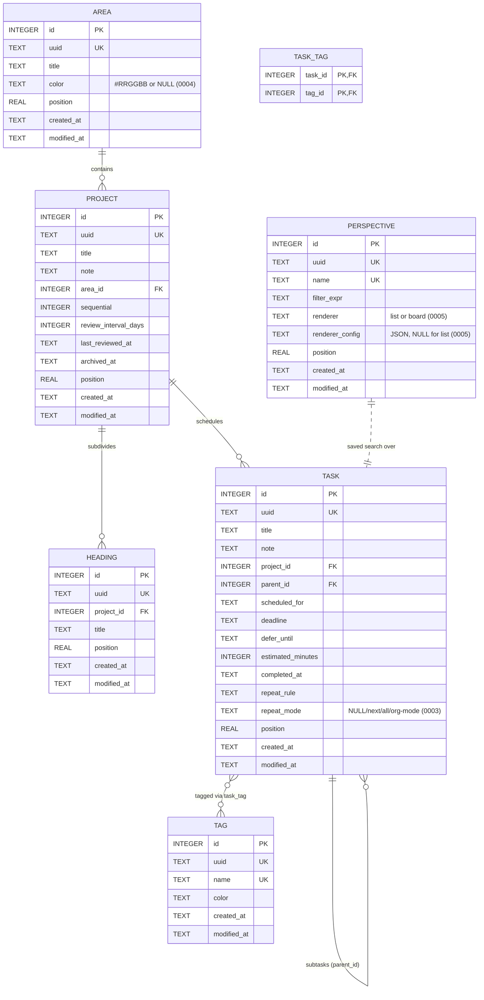

# Atrium — Schema Reference

This document is the **rationale** for the schema. The **contract** lives in [`spec.md`](../spec.md) §4 and the canonical SQL in [`atrium-core/src/db/migrations/0001_initial.sql`](../atrium-core/src/db/migrations/0001_initial.sql). When in doubt, the SQL wins.

> **Schema discipline.** Migration `0001_initial.sql` shipped the full OmniFocus superset. The v0.1 line was schema-frozen — every Builder-mode column already existed. The freeze ended at v0.2.0. Migrations are now **append-only and backwards-compatible**: add columns / tables / triggers / indexes; renames + drops are major-bump-only. Current `user_version`: **7**. Migration history below.

## Migration history

| Migration | Phase / Version | What it does |
|---|---|---|
| `0001_initial.sql` | Phase 1 / v0.1.0 | OmniFocus superset — area, project, heading, task, tag, task_tag, FTS5, triggers, indexes |
| `0002_perspectives.sql` | Phase 14 / v0.1.17 | Adds `perspective` table for saved searches (additive) |
| `0003_repeat_mode.sql` | Phase 15 / v0.2.0 | First `ALTER TABLE` — adds `task.repeat_mode` (`NULL` / `'next'` / `'all'` / `'org-mode'`) for Org-mode-style completion semantics |
| `0004_area_color.sql` | Phase 15.75 Slice A / v0.5.0 | Adds `area.color` (`TEXT NULL`, `'#RRGGBB'`) for per-area accent |
| `0005_perspective_renderer.sql` | Phase 15.75 Slice A / v0.5.0 | Adds `perspective.renderer` (`'list'` / `'board'`, default `'list'`) + `perspective.renderer_config` (TEXT, JSON config — used by the kanban renderer for column definitions) |
| `0006_task_last_reviewed_at.sql` | Phase 13 follow-up / v0.7.4 | Adds `task.last_reviewed_at` (TEXT NULL) for the canonical Review page's task-level Mark Reviewed action. Mirror of `project.last_reviewed_at`; rows reviewed within the last 7 days hide from the weekly walk. |
| `0007_task_orig_keyword.sql` | Phase 16 / v0.7.12 | Adds `task.orig_keyword` (TEXT NULL) so the Org importer can stash non-canonical Org keywords (`WAITING`, `BLOCKED`, `IN-PROGRESS`, etc.) for round-trip preservation by the writer. Atrium's domain keeps three canonical states (TODO / DONE / CANCELLED); this column is the file-level label round-trip anchor only. |

## Entity-Relationship diagram

## Per-table rationale

### `area`
Top-level grouping. Areas hold projects; deleting an area unfiles its projects rather than nuking them (`ON DELETE SET NULL`). Things 3 calls these "Areas of Responsibility"; OmniFocus calls them "Folders." Same concept. `color` (added in `0004`) is an optional `'#RRGGBB'` accent driving the per-area sidebar accent introduced in v0.5.0 Slice B; `NULL` means "use the GTK accent."

### `project`
Lives in an area or unfiled (`area_id NULL`). All Builder-only GTD fields (`sequential`, `review_interval_days`, `last_reviewed_at`) exist from day one — Mode-as-View dictates schema completeness. `archived_at` carries Logbook semantics for completed projects (Things 3 archives projects on completion; OmniFocus calls them "Dropped"/"Done"). `ON DELETE CASCADE` to tasks: deleting a project deletes its tasks, matching user expectation.

### `heading`
Project subdivisions. Builder UI exposes editing in v0.1; Simple displays them inline as section breaks. `ON DELETE CASCADE` from project: headings can't outlive their project.

### `task`
The central row. Several columns deserve specific notes:

- **`project_id`** `NULL` → Inbox. The Inbox is a state, not a stored row.
- **`parent_id`** for subtasks. The schema supports arbitrary nesting depth; the Simple Mode UI in v0.1 doesn't render nesting (Builder Mode in v0.2 does). `ON DELETE CASCADE`: deleting a parent deletes its children.
- **`scheduled_for`** is `TEXT`: ISO date (`2026-05-15`) **or** the literal string `'__someday__'`. Someday is a *state*, not a future date — placing it in `scheduled_for` rather than a separate column keeps the derived-view filters honest (every list filters on the same column).
- **`deadline`** is ISO date. Distinct from `scheduled_for`: deadline says "must be done by," scheduled says "I plan to do it on." Most Things-3 clones conflate the two; Atrium does not.
- **`defer_until`** is Builder-only. Tasks invisible in Today / Anytime until the date passes. Implemented in Phase 11.
- **`completed_at`** is ISO datetime; `NULL` = open task. Logbook is `WHERE completed_at IS NOT NULL`. Hard-delete model — there is no `deleted_at` column. Per Phase 1 design call.
- **`repeat_rule`** stores the canonical RFC 5545 RRULE as text. Org-mode export renders a best-effort approximation in the SCHEDULED cookie (spec §7.3.3 rule 3).
- **`repeat_mode`** (added in `0003`) controls completion semantics for repeating tasks: `NULL` (no repeat), `'next'` (advance to next occurrence — Things 3 default), `'all'` (regenerate the whole rule), `'org-mode'` (preserve original schedule, log completion to LOGBOOK). See `atrium-core/src/repeat.rs`.
- **`last_reviewed_at`** (added in `0006`) is the task-level analogue of `project.last_reviewed_at`. Stamped by the `MarkTaskReviewed` worker command from the canonical Review page's per-row Mark Reviewed button. The Review page's weekly-walk filter excludes tasks reviewed within the last 7 days; otherwise the column is unread. NULL means "never reviewed."
- **`orig_keyword`** (added in `0007`) is the Phase 16 round-trip anchor for non-canonical Org keywords. The Org importer stashes the original (`WAITING`, `BLOCKED`, `IN-PROGRESS`, etc.) here when it sees a TODO state Atrium doesn't model; the Org writer consults the column when emitting so the original keyword survives a vault round-trip. Atrium's UI never surfaces this column — completion semantics still flow through `completed_at` alone.
- **`position`** is `REAL` — midpoint insertion enables arbitrary reorder without renumbering siblings.

### `tag`
`name` is **`UNIQUE COLLATE NOCASE`** so `Errand` and `errand` merge. Color is optional (`TEXT NULL`, `'#RRGGBB'` or NULL) — UI provides the swatch; the canonical value lives here so Org-vault projection (Phase 17) can read it from the sidecar `.atrium/config.toml`.

### `task_tag`
Composite primary key `(task_id, tag_id)` doubles as a uniqueness constraint. Both FKs `ON DELETE CASCADE`: deleting a tag removes its associations; deleting a task removes its tag links.

### `perspective`
Saved search. `filter_expr` stores the expression-language query verbatim (parsed at evaluation time, not at save time, so syntax updates apply retroactively). Added in `0002` as a list-renderer table; `0005` extended it with `renderer` (`'list'` / `'board'`, default `'list'`) and `renderer_config` (TEXT NULL — JSON column definitions for the kanban renderer; ignored when `renderer = 'list'`). The kanban projection logic lives in `atrium-core/src/render.rs`.

## Datetime format

All temporal columns are `TEXT` in ISO 8601:

- **Dates** (`scheduled_for`, `deadline`, `defer_until`): `YYYY-MM-DD`.
- **Datetimes** (`completed_at`, `created_at`, `modified_at`, `last_reviewed_at`, `archived_at`): `YYYY-MM-DDTHH:MM:SS.sssZ`.

ISO 8601 strings sort lexicographically and identically to chronological order. The `chrono` crate marshals to/from these via rusqlite's `chrono` feature without lossy conversions. The `'__someday__'` sentinel for `scheduled_for` could not be represented as INTEGER unix without ugly magic values.

## `created_at` / `modified_at` triggers

Five `AFTER UPDATE` triggers (one per table that carries the columns) bump `modified_at` to `strftime('%Y-%m-%dT%H:%M:%fZ', 'now')` whenever a row is modified. Each trigger has a `WHEN old.modified_at = new.modified_at` clause that:

1. **Prevents recursion** — the trigger's own UPDATE flips `modified_at`, after which `old.modified_at != new.modified_at` and the trigger doesn't re-fire.
2. **Lets explicit writes survive** — during import (Phase 16+) we may want to preserve the source's original `modified_at`. Setting `modified_at` explicitly in the UPDATE makes `old != new` and the trigger sits out.

Tested by `db::tests::modified_at_trigger_fires` and `db::tests::explicit_modified_at_survives_trigger`.

## Full-text search

`task_fts` is an FTS5 virtual table linked to `task` by `content='task', content_rowid='id'`. It indexes `title` + `note`. Three triggers keep it synced (`task_fts_insert`, `task_fts_delete`, `task_fts_update`). Tokenizer is **`unicode61`** — no stemming. Per Phase 1 design call, predictability beats fuzzy matching for short task titles; stemming may land in v0.2 as an option.

Search is exposed in Phase 7 with `Ctrl+F`.

## Indexes

| Index | Covers |
|---|---|
| `idx_task_project_completed` (project_id, completed_at) | Inbox (project_id IS NULL), per-project lists, completion filtering |
| `idx_task_scheduled_for_open` (scheduled_for) WHERE completed_at IS NULL | Today, Upcoming, Someday |
| `idx_task_deadline_open` (deadline) WHERE completed_at IS NULL | Deadline-driven Today entries |
| `idx_task_defer_until_open` (defer_until) WHERE completed_at IS NULL | Builder defer filter |
| `idx_task_completed_at` (completed_at) WHERE completed_at IS NOT NULL | Logbook scan ordered by completion |
| `idx_task_parent_id` (parent_id) WHERE parent_id IS NOT NULL | Subtask traversal |
| `idx_project_area_id` (area_id) | Project lookup per area |
| `idx_project_archived` (archived_at) | Active vs archived projects |
| `idx_heading_project_id` (project_id) | Headings within a project |
| `idx_task_tag_tag_id` (tag_id) | Reverse tag lookup |

`UNIQUE` constraints on `uuid`/`name` are automatic indexes. Partial indexes (`WHERE …`) shrink the indexed subset to the rows the relevant queries actually scan.

## Pragmas

Every connection (writable and read-only) is configured via `db::configure_pragmas`:

| Pragma | Value | Why |
|---|---|---|
| `journal_mode` | `WAL` | Many-readers + one-writer; the worker-pattern depends on it |
| `synchronous` | `NORMAL` | Durable across power loss when paired with WAL; faster than `FULL` |
| `temp_store` | `MEMORY` | FTS5 sort scratch in RAM |
| `mmap_size` | `268435456` (256 MB) | Read-path mmap window |
| `foreign_keys` | `ON` | SQLite ships them off; we always want them on |

## Migration model

`PRAGMA user_version` drives state. The `MIGRATIONS` const in [`atrium-core/src/db/migrations/mod.rs`](../atrium-core/src/db/migrations/mod.rs) is an ordered slice of `(version, embedded_sql)` pairs. The runner:

1. Reads `user_version`.
2. For each migration with `version > current`:
   - Opens a transaction.
   - Runs the SQL via `execute_batch`.
   - Sets `user_version` (which **is** transactional, unlike most pragmas).
   - Commits.

Failed migrations roll back; the schema stays at the previous version. Idempotent: running on an already-migrated database is a no-op. Tested.

## Hard-delete model

v0.1 has **no soft-delete**. Deleting a task removes it from the database. Logbook holds completed tasks (filter on `completed_at IS NOT NULL`); deleted tasks are gone forever. Per Phase 1 design call. Soft-delete can be added in v0.2 with a backwards-compatible migration if it earns its keep.

## Foreign-key cascade map

| Parent → Child | On delete |
|---|---|
| `area` → `project` | `SET NULL` (unfile, don't nuke) |
| `project` → `task` | `CASCADE` (delete project → delete tasks) |
| `project` → `heading` | `CASCADE` |
| `task` → `task` (parent_id) | `CASCADE` (delete parent → delete subtasks) |
| `task` → `task_tag` | `CASCADE` |
| `tag` → `task_tag` | `CASCADE` |
